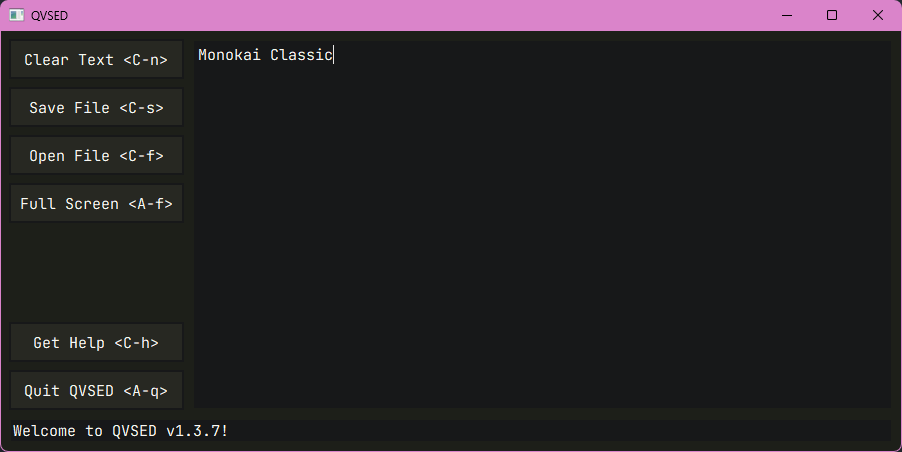
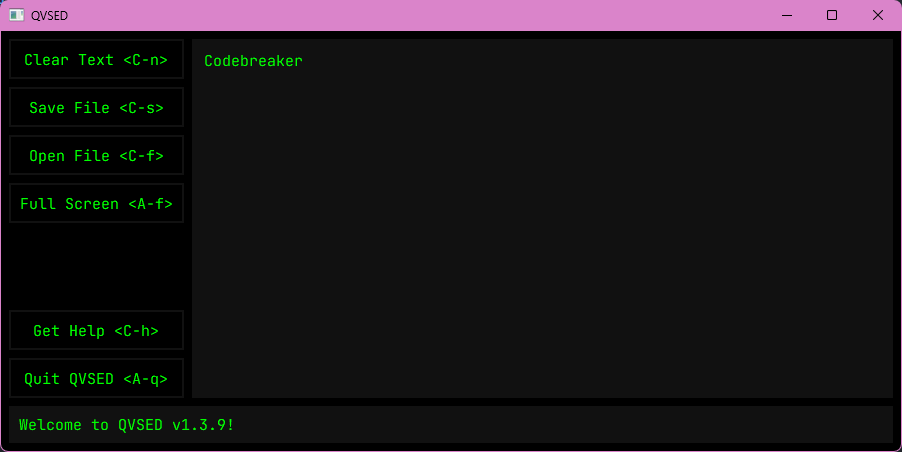

# QVSED Colour Schemes

These colour schemes can be applied to QVSED in its [config file](README.md#configuration).

## Colour Scheme List

The following colour schemes are arranged in ascending order, from the earliest to the latest.

If this file gets too big I'll reorganise them in alphabetical order or something.

### Monokai Classic



```python
# Monokai Classic, taken from sampling Doom Emacs' doom-monokai-classic theme
text_color = "#F8F8F2"
background_color = "#1D1F19"
button_color = "#272822"
button_focus_color = "#171819"
```

### Codebreaker



```python
# Codebreaker, That1M8Head named this one himself
text_color = "#00FF00"
background_color = "#000000"
button_color = "#000000"
button_focus_color = "#111111"
```

More will be added when I care enough to do so.
