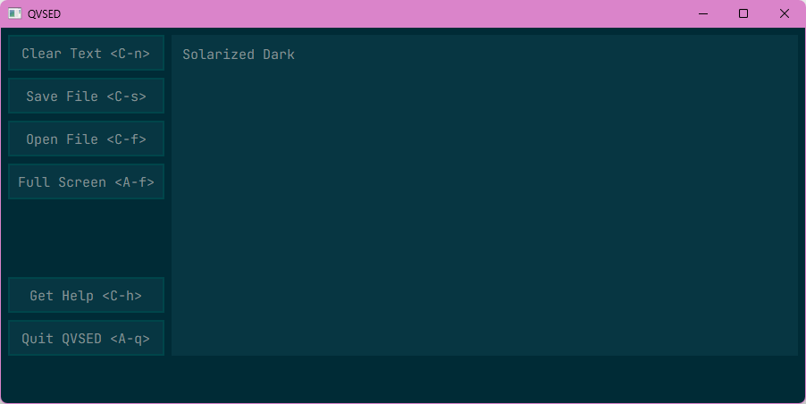

# QVSED Colour Schemes

These colour schemes can be applied to QVSED in its [config file](README.md#configuration).

## Colour Scheme List

Themes made before QVSED v1.4.1 did not include `text_area_color`, `echo_area_color`
or `button_pressed_color`, so QVSED will replace the old themes' missing colour
definitions with [equivalents](#equivalents).

Colour options relating to the scroll bar also didn't exist before v1.4.2, so it's
the same thing in that case.

### ASMED


```python
# ASMED, inspired by the original ASMED, QVSED's predecessor
text_color = "#FFFFFF"
background_color = "#21222D"

button_color = "#40455A"
button_hover_color = "#4C526C"
button_pressed_color = "#878DA2"

text_area_color = button_color
echo_area_color = button_color

scroll_bar_color = "#5B6074"
scroll_bar_hover_color = "#757A91"
scroll_bar_pressed_color = "#43475A"
```

### Banana


```python
# Banana, a light theme inspired by bananas
text_color = "#331f00"
background_color = "#fff3bf"

button_color = "#b7eb76"
button_hover_color = "#f0ee82"
```

### Bubblegum


```python
# Bubblegum, a light pink low-contrast colour scheme with dark text
text_color = "#4C4C4C"
background_color = "#FCEFF1"

button_color = "#F8D7DC"
button_hover_color = "#F9E1E6"
button_pressed_color = "#FCEFF1"

text_area_color = "#F9E1E6"
echo_area_color = "#F8D7DC"

scroll_bar_color = "#F8D7DC"
scroll_bar_background_color = "#FCEFF1"
scroll_bar_hover_color = "#F9E1E6"
scroll_bar_pressed_color = "#FCEFF1"
```

### Buttercream


```python
# Buttercream, a light-yellow theme
text_color = "#000000"
background_color = "#ffffda"

button_color = "#fff7b1"
button_hover_color = "#fffad3"
```

### Codebreaker


```python
# Codebreaker, That1M8Head named this one himself
text_color = "#00FF00"
background_color = "#000000"

button_color = "#000000"
button_hover_color = "#111111"
```

### Monokai


```python
# Monokai, taken from sampling Doom Emacs' doom-monokai-classic theme
text_color = "#F8F8F2"
background_color = "#1D1F19"

button_color = "#272822"
button_hover_color = "#171819"
```

### Solarized Dark



```python
# Solarized Dark, you already know this one ;)
text_color = "#839496"
background_color = "#002B36"

button_color = "#073642"
button_hover_color = "#00454A"
button_pressed_color = "#00212B"

text_area_color = "#073642"
echo_area_color = "#002B36"

scroll_bar_color = "#586E75"
scroll_bar_background_color = "#002B36"
scroll_bar_hover_color = "#93A1A1"
scroll_bar_pressed_color = "#073642"
```

### Solarized Light


```python
# Solarized Light, you already know this one ;)
text_color = "#657B83"
background_color = "#FDF6E3"

button_color = "#EEE8D5"
button_hover_color = "#D4CDC3"
button_pressed_color = "#B3AFA6"

text_area_color = "#EEE8D5"
echo_area_color = "#FDF6E3"

scroll_bar_color = "#839496"
scroll_bar_background_color = "#FDF6E3"
scroll_bar_hover_color = "#93A1A1"
scroll_bar_pressed_color = "#657B83"
```

## Equivalents

If the following definitions aren't found in config.py, they'll be replaced
with their equivalents.

| Definition                    | Equivalent             |
| ----------------------------- | ---------------------- |
| `button_pressed_color`        | `background_color`     |
| `text_area_color`             | `button_hover_color`   |
| `echo_area_color`             | `button_hover_color`   |
| `scroll_bar_color`            | `button_color`         |
| `scroll_bar_background_color` | `button_hover_color`   |
| `scroll_bar_hover_color`      | `button_pressed_color` |
| `scroll_bar_pressed_color`    | `button_pressed_color` |

This may or may not look good, so it's recommended to set these values yourself.

For any of the other definitions, if their values aren't specified, your config.py
will be reset.
